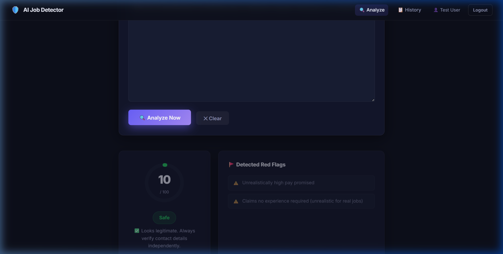
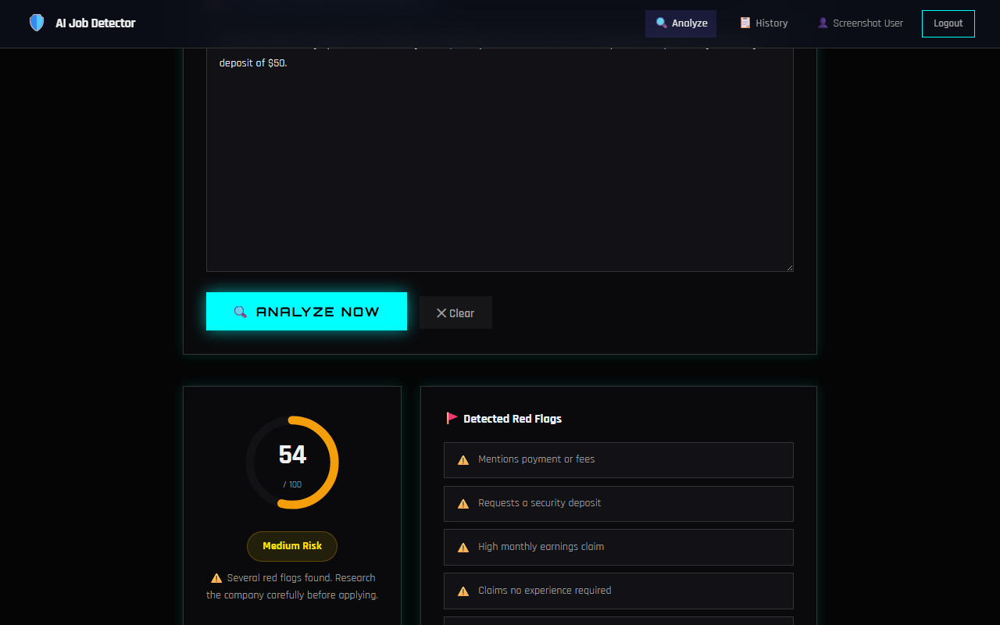
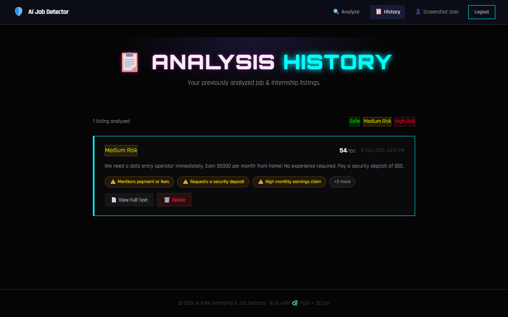

# 🛡️ AI Fake Internship & Job Detector

[](https://www.python.org/)
[](https://flask.palletsprojects.com/)
[](https://www.sqlite.org/)

Detect fake job and internship listings using specialized AI scoring. This tool scans descriptions for 35+ scam indicators like payment demands, unrealistic salaries, and suspicious contact methods.

---

## 📸 Site Preview

### 🔍 Smart Analyzer

*Paste any description and get an instant score.*

### 📊 Detailed Findings

*See exactly why a listing was flagged with red flags.*

### 📋 Analysis History

*Keep track of all your past checks in a secure archive.*

---

## ✨ Features

- **🚀 Instant Analysis**: Get a scam score (0–100) and risk level in seconds.
- **🚩 Red Flag Detection**: Points out specific suspicious phrases and patterns.
- **🔐 Secure Auth**: Private user accounts with encrypted password storage.
- **📜 Session History**: Save and manage your previous analysis results.
- **🌑 Dark Mode UI**: Modern, professional interface designed for focus.
- **💾 0-Setup DB**: Now uses **SQLite** for out-of-the-box functionality (no XAMPP required).

---

## ⚙️ Quick Start

### 1. Requirements
- Python 3.9 or higher.

### 2. Install Dependencies
```bash
pip install -r requirements.txt
```

### 3. Run the Application
```bash
python app.py
```
*The database will be automatically initialized on the first run.*

### 4. Access
Open your browser at: **https://ai-job-detector.vercel.app/**

---

## 📁 File Structure

```text
AI-JOB-Detector/
├── app.py              # Flask backend & SQLite logic
├── scam_detector.py    # AI scoring engine (35+ regex patterns)
├── schema.sql          # Database structure
├── job_detector.db     # SQLite database (Auto-generated)
├── templates/          # Frontend HTML (Jinja2)
├── static/             # CSS & Client-side JS
└── docs/screenshots/   # Documentation images
```

---

## 🧠 How It Works

The engine scans job postings for patterns across several high-risk categories:
- **💰 Money**: Requests for security deposits, registration fees, or kit charges.
- **🤑 Pay**: Unrealistic daily/monthly earnings for entry-level roles.
- **📵 Contact**: Hiring via WhatsApp/Telegram only or using generic Gmail addresses.
- **🏦 Data**: Unusual requests for Aadhar, Bank details, or IDs during application.

---

## 🔒 Security
- **Hashed Passwords**: Uses `bcrypt` for industry-standard security.
- **Parameterized Queries**: Protected against SQL injection.
- **Local Storage**: Your data stays on your machine.

---

## 🤝 Contributing
Feel free to fork this project and submit pull requests for more scam detection patterns!

Developed with ❤️ by **Sahil Raj**
